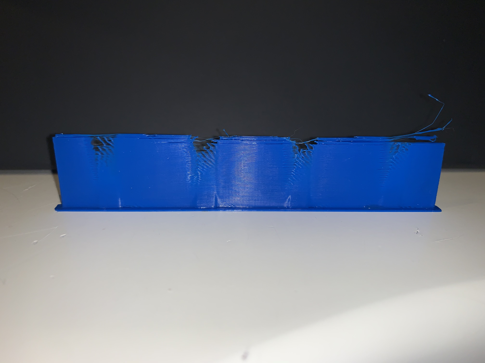
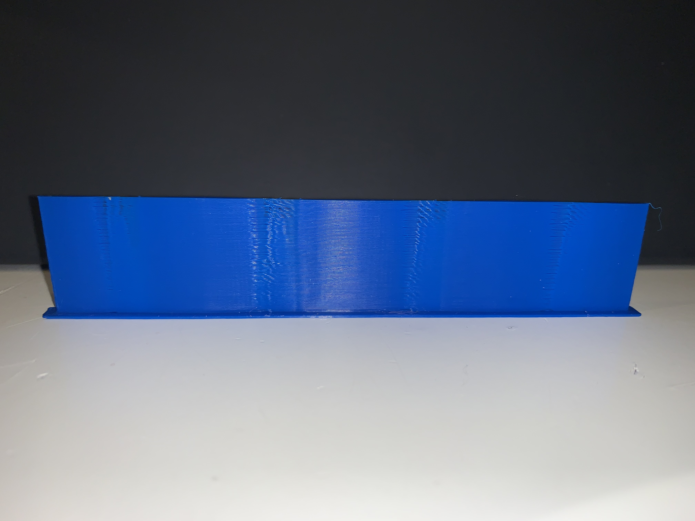
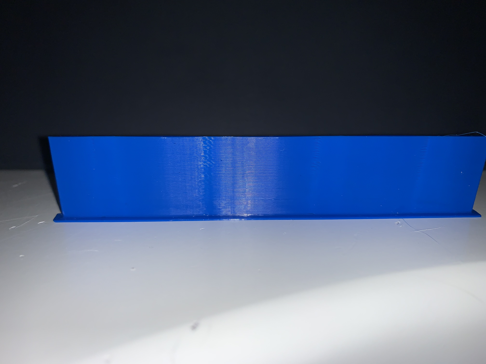
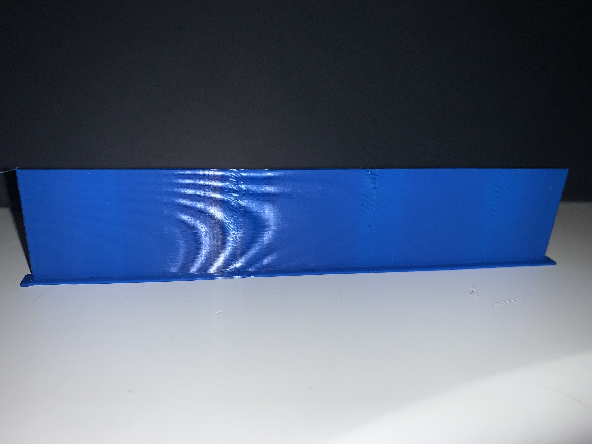

# Tune-Linear-Pressure-Advance
Tuneable Python Code to generate a Linear Advance/Pressure Advance gcode file for Marlin or Duet with reporting. This is a modification of a script that I found on the [Duet Forum](https://forum.duet3d.com/topic/6698/pressure-advance-calibration)

# Getting Started

## Editing the code
- all tuneable items are at the very top between lines 5 and 38
- Change the min/max values for Linear Advance
- inspect the printed result and adjust as needed until the perfect settings are found.

## To generate the gcode simply run:
- python3 generate_linearadvance_gcode.py > outputfile.gcode

# How to read/use the result:

Here is the output for me for 0.0 to 1.0:

Based upon this I concluded that I needed somewhere between 0.3 and 0.6:

At/around 0.4 I started seeing issues so I generated another with just 0.3 to 0.4:

Based upon this result I needed this to be between 0.325 and 0.375 so I generated one more time to find out where:

I ended up settling with 0.350 as thats where the artifacts disappeared and started reappearing shortly there after.